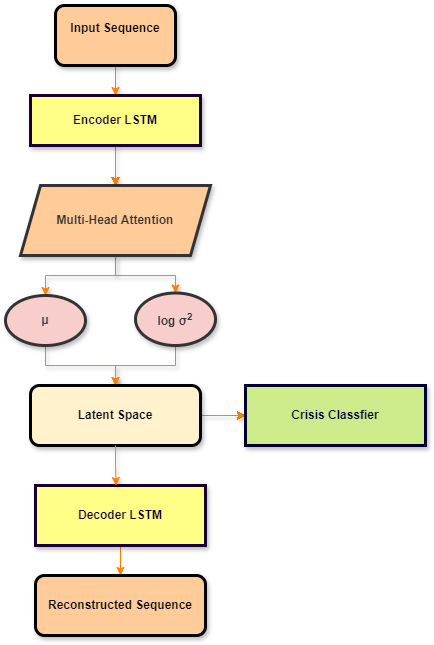

# A Detection framework for Financial Risk using a Recurrent Variational Autoencoder (R-VAE)

This project implements a Recurrent Variational Autoencoder (R-VAE) to detect periods of financial crisis from market time-series data. The model is trained on a wide range of financial instruments and learns to identify anomalous patterns indicative of market stress.

## Project Structure

- `rvae_financial_crisis_detector.ipynb`: The main Jupyter Notebook to run the entire pipeline from data loading to evaluation.
- `configs/`: Configuration files.
  - `market_symbols.json`: A list of financial symbols to download.
- `models/`: Directory where trained model weights are saved.
- `results/`: Directory where evaluation plots and reports are saved.
- `pipeline.png`: A simple overview image of the underlying architecture.
- `detection_framework_for_financial_risk_RVAE_presentation.pdf`: Presentation of the project
- `requirements.txt`: A list of required Python packages.

## Data

This project utilizes a comprehensive set of financial time-series data, programmatically sourced from **Yahoo Finance** via the  `yfinance` Python library.

The dataset consists of daily closing prices for a wide array of financial instruments, spanning a long historical period to cover multiple economic cycles. The selection is designed to provide a holistic view of global market dynamics and includes:

- **Major Market Indices**: S&P 500, NASDAQ, Dow Jones.

- **Volatility Measures**: The CBOE Volatility Index (VIX).

- **Sector-Specific ETFs**: Covering all major economic sectors like Technology, Financials, and Energy.

- **Fixed Income**: US Treasury bond ETFs of various maturities.

- **Commodities & Currencies**: Key assets such as Gold, Oil, and the US Dollar.

The complete list of ticker symbols is managed in the `configs/market_symbols.json` file, allowing for easy customization. By leveraging this diverse and publicly available data, the model is trained to recognize the complex, cross-asset patterns that often precede periods of systemic crisis

## Usage

1.  **Install Dependencies:**
    ```bash
    pip install -r requirements.txt
    ```

2.  **Run the Notebook:**
    Open and run the cells in `rvae_financial_implementation.ipynb`. The notebook will guide you through:
    - Loading configuration.
    - Fetching financial data.
    - Processing the data for two window sizes (15 and 22 days).
    - Training a separate R-VAE model for each window size.
    - Evaluating the models and saving the results.

3.  **Check the Outputs:**
    - Trained model weights (`.pth` files) will be saved in the `models/` directory.
    - Training history plots and the final crisis detection dashboard will be saved in the `results/` directory.

## Implementation Choices

The core of the framework is a hybrid **Recurrent Variational Autoencoder (R-VAE)**. This architecture was chosen to address the unique challenges of financial crisis detection:

- *Recurrent LSTM Layers*: The Long Short-Term Memory (LSTM) cells are essential for capturing temporal dependencies and sequential patterns within the financial time-series data.

- *Variational Autoencoder (VAE) Structure*: This provides a powerful unsupervised learning framework. The model learns a compressed, probabilistic representation (a latent space) of "normal" market conditions. Periods that are difficult to reconstruct from this latent space are flagged as anomalies.

- *Supervised Classification Head*: To enhance performance, a simple classification layer is added on top of the latent space. This allows the model to leverage historical crisis labels, combining the VAE's ability to detect novel anomalies with the precision of a supervised approach.

- *Robust Data Scaling*: Financial returns are known for their heavy tails and extreme outliers. We use RobustScaler from scikit-learn, which scales data based on the interquartile range, making it far more resilient to outliers than standard scaling methods.

- *Multi-Objective Loss Function*: The model is trained by optimizing a composite loss that includes reconstruction error (MSE), the KL divergence of the latent space, and a classification loss (BCE). This ensures all aspects of the hybrid architecture are trained effectively.



## Results

The implemented **R-VAE** model achieves high accuracy in identifying historical financial crisis periods from market data. The final implementation is robust and well-structured, providing a reliable system for market risk analysis.

Navigate into `/results` folder to see the default results.

## Authors

- **Ricatti Luca**, SM3800083, luca.ricatti@studenti.units.it 
- **Tavano Matteo**, SM3800057,  matteo.tavano@studenti.units.it

Both autors has contributed to this project equally.
AI has been used to refactor notebook cells and to improve the descriptions quality.

## References

- Yahoo Finance
Official source for real-time and historical financial market data.
🔗 https://finance.yahoo.com

- YFinance – Yahoo! Finance Market Data Downloader
Python library for accessing historical market data from Yahoo Finance.
🔗 https://pypi.org/project/yfinance/

- Simon J.D. Prince – Understanding Deep Learning: From Theory to Algorithms
Comprehensive textbook on deep learning, including Variational Autoencoders (VAEs).
📄 DOI: 10.1017/9781009153163

- Daniel Jurafsky & James H. Martin – Speech and Language Processing
Standard reference on natural language processing and sequential models (e.g., RNNs, LMs).
📄 DOI: 10.48550/arXiv.2104.03503
